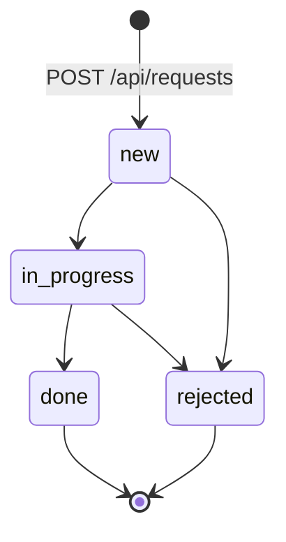

# Equipment Maintenance API

REST API для учёта оборудования ветро- и солнечной генерации и заявок на обслуживание. По координатам оборудования запрашивается прогноз Open-Meteo: можно понять, подходят ли ближайшие сутки для наружных работ (нет осадков и ветер ниже порога).

Данные хранятся в JSON-файлах (`EQUIPMENT_FILE`, `REQUESTS_FILE`). Изменяющие запросы (`POST`, `PATCH`, `DELETE`) требуют ключ в `X-API-Key` или `Authorization: Bearer <ключ>`. GET открыт.

Базовый URL: `http://localhost:3000/api`.

## Запуск

```bash
git clone https://github.com/marylaf/weather-digest.git
cd weather-digest
cp .env.example .env
npm install
npm run api
```

Нужны Node.js 20+, npm и доступ к Open-Meteo (для `GET /api/equipment/:id/weather`).

| Команда                         | Назначение                                    |
| ------------------------------- | --------------------------------------------- |
| `npm run api`                   | Express API и HTML-страница заявок на `:3000` |
| `npm run api:dev`               | то же с перезапуском при изменениях           |
| `npm test`                      | Jest + Supertest                              |
| `docker compose up --build api` | API в контейнере на `:3000`                   |
| `npm run web`                   | Vite-просмотр сохранённых отчётов на `:5173`  |
| `npm start -- --city "Москва"`  | CLI-сводка погоды (отдельный режим)           |

## Эндпоинты

| Метод    | Путь                          | Auth | Код           | Описание                                                                                                                  |
| -------- | ----------------------------- | ---- | ------------- | ------------------------------------------------------------------------------------------------------------------------- |
| `GET`    | `/api/health`                 | нет  | `200`         | Проверка живости: `{ "status": "ok" }`                                                                                    |
| `GET`    | `/api/equipment`              | нет  | `200`         | Список оборудования. Query: `status`, `type`, `installedFrom`, `installedTo`, `sortBy`, `order`, `page`, `limit`          |
| `POST`   | `/api/equipment`              | да   | `201`         | Создать оборудование. Заголовок `Location: /api/equipment/:id`                                                            |
| `GET`    | `/api/equipment/:id`          | нет  | `200`         | Карточка оборудования                                                                                                     |
| `PATCH`  | `/api/equipment/:id`          | да   | `200`         | Частичное обновление                                                                                                      |
| `DELETE` | `/api/equipment/:id`          | да   | `204`         | Удалить, если нет открытых заявок (`new` / `in_progress`)                                                                 |
| `GET`    | `/api/equipment/:id/requests` | нет  | `200`         | Заявки по оборудованию. Query: `status`, `priority`, `createdFrom`, `createdTo`, `sortBy`, `order`, `page`, `limit`       |
| `GET`    | `/api/equipment/:id/weather`  | нет  | `200`         | Прогноз Open-Meteo и флаг `outdoorWorkSuitable`                                                                           |
| `GET`    | `/api/requests`               | нет  | `200`         | Список заявок. Query: `status`, `priority`, `equipmentId`, `createdFrom`, `createdTo`, `sortBy`, `order`, `page`, `limit` |
| `POST`   | `/api/requests`               | да   | `201`         | Создать заявку (`status` всегда `new`). `Location: /api/requests/:id`                                                     |
| `POST`   | `/api/requests/import`        | да   | `201` / `207` | Пакетная загрузка: ошибки по записям не откатывают успешные. До 100 элементов                                             |
| `GET`    | `/api/requests/:id`           | нет  | `200`         | Карточка заявки                                                                                                           |
| `PATCH`  | `/api/requests/:id`           | да   | `200`         | Поля заявки без смены статуса                                                                                             |
| `PATCH`  | `/api/requests/:id/status`    | да   | `200`         | Смена статуса по графу переходов                                                                                          |
| `DELETE` | `/api/requests/:id`           | да   | `204`         | Удалить заявку                                                                                                            |

Списки отвечают `{ "data": [...], "meta": { "total", "page", "limit" } }`. По умолчанию `page=1`, `limit=10`, максимум `limit=100`. Карточка — `{ "data": { ... } }`. Удаление — пустое тело.

## Модель

### Equipment

| Поле           | Тип    | Ограничения                                                   |
| -------------- | ------ | ------------------------------------------------------------- |
| `id`           | string | UUID, выдаёт сервер                                           |
| `name`         | string | 3–100 символов                                                |
| `type`         | enum   | `turbine` \| `inverter` \| `sensor` \| `substation`           |
| `serialNumber` | string | не пустой, уникальный                                         |
| `location.lat` | number | −90…90                                                        |
| `location.lon` | number | −180…180                                                      |
| `status`       | enum   | `operational` \| `maintenance` \| `fault` \| `decommissioned` |
| `installedAt`  | string | ISO-дата, не в будущем                                        |

### MaintenanceRequest

| Поле          | Тип     | Ограничения                                    |
| ------------- | ------- | ---------------------------------------------- |
| `id`          | string  | UUID, выдаёт сервер                            |
| `equipmentId` | string  | должен существовать                            |
| `title`       | string  | 5–120 символов                                 |
| `description` | string  | до 2000 символов                               |
| `priority`    | enum    | `low` \| `medium` \| `high` \| `critical`      |
| `status`      | enum    | `new` \| `in_progress` \| `done` \| `rejected` |
| `plannedAt`   | string? | ISO datetime                                   |
| `createdAt`   | string  | ISO datetime, выдаёт сервер                    |
| `updatedAt`   | string  | ISO datetime, выдаёт сервер                    |

## Переходы статусов заявки

Статус меняется только через `PATCH /api/requests/:id/status`. Терминальные `done` и `rejected` дальше не двигаются. Недопустимый переход — `409 CONFLICT`.



| Из            | Куда                      |
| ------------- | ------------------------- |
| `new`         | `in_progress`, `rejected` |
| `in_progress` | `done`, `rejected`        |
| `done`        | —                         |
| `rejected`    | —                         |

Открытые заявки — `new` и `in_progress`. Пока они есть, `DELETE /api/equipment/:id` возвращает `409`.

## Формат ошибки

Все ошибки API — один JSON. Поле `details` есть у валидации.

```json
{
  "error": {
    "code": "VALIDATION_ERROR",
    "message": "Некорректные данные запроса",
    "details": [{ "field": "name", "message": "Слишком короткое значение" }],
    "requestId": "7c2e9a1b-4f0d-4c8a-9e21-0b1c2d3e4f5a"
  }
}
```

| HTTP | `code`                         | Когда                                                                    |
| ---- | ------------------------------ | ------------------------------------------------------------------------ |
| 400  | `VALIDATION_ERROR`             | битый JSON, который Express не смог разобрать                            |
| 422  | `VALIDATION_ERROR`             | Zod: невалидные body, query или params                                   |
| 401  | `UNAUTHORIZED`                 | нет или неверный ключ на POST/PATCH/DELETE                               |
| 404  | `NOT_FOUND`                    | неизвестный id, маршрут или `equipmentId` при создании заявки            |
| 409  | `CONFLICT`                     | занятый `serialNumber`, открытые заявки при удалении, запрещённый статус |
| 413  | `PAYLOAD_TOO_LARGE`            | JSON больше `JSON_BODY_LIMIT` (по умолчанию 100kb)                       |
| 429  | `RATE_LIMIT_EXCEEDED`          | превышен лимит `/api`                                                    |
| 503  | `EXTERNAL_SERVICE_UNAVAILABLE` | Open-Meteo недоступен или вернул некорректный ответ                      |
| 500  | `INTERNAL_ERROR`               | непредвиденная ошибка                                                    |

## Примеры 201 / 400 / 409

### 201 Created

```bash
curl -s -D - http://localhost:3000/api/equipment \
  -H "Content-Type: application/json" \
  -H "X-API-Key: $API_KEY" \
  -d '{
    "name": "Moscow turbine",
    "type": "turbine",
    "serialNumber": "WT-001",
    "location": { "lat": 55.75, "lon": 37.62 },
    "status": "operational",
    "installedAt": "2024-06-01"
  }'
```

```http
HTTP/1.1 201 Created
Location: /api/equipment/8f3c1a2b-4d5e-6f70-8192-a3b4c5d6e7f8
```

```json
{
  "data": {
    "id": "8f3c1a2b-4d5e-6f70-8192-a3b4c5d6e7f8",
    "name": "Moscow turbine",
    "type": "turbine",
    "serialNumber": "WT-001",
    "location": { "lat": 55.75, "lon": 37.62 },
    "status": "operational",
    "installedAt": "2024-06-01"
  }
}
```

Так же создаётся заявка: `POST /api/requests` с `equipmentId`, `title` (≥ 5 символов), `description`, `priority`. Сервер ставит `status: "new"`.

### 422 VALIDATION_ERROR

`name` короче 3 символов (схема Zod). Битый JSON (`{"name":`) даёт тот же `code`, но HTTP **400**.

```bash
curl -s http://localhost:3000/api/equipment \
  -H "Content-Type: application/json" \
  -H "X-API-Key: $API_KEY" \
  -d '{
    "name": "ab",
    "type": "turbine",
    "serialNumber": "WT-002",
    "location": { "lat": 55.75, "lon": 37.62 },
    "status": "operational",
    "installedAt": "2024-06-01"
  }'
```

```json
{
  "error": {
    "code": "VALIDATION_ERROR",
    "message": "Некорректные данные запроса",
    "details": [{ "field": "name", "message": "Слишком короткое значение" }],
    "requestId": "…"
  }
}
```

### 409 CONFLICT

Повтор того же `serialNumber`:

```bash
curl -s http://localhost:3000/api/equipment \
  -H "Content-Type: application/json" \
  -H "X-API-Key: $API_KEY" \
  -d '{ … "serialNumber": "WT-001" … }'
```

```json
{
  "error": {
    "code": "CONFLICT",
    "message": "Equipment with this serialNumber already exists",
    "requestId": "…"
  }
}
```

Другие `409`:

- `PATCH /api/requests/:id/status` с `{ "status": "done" }` у заявки в `new` → `Cannot transition status from new to done`
- `DELETE /api/equipment/:id`, пока есть заявки `new` / `in_progress` → `Equipment has open maintenance requests`

### 400 VALIDATION_ERROR

```bash
curl -s http://localhost:3000/api/equipment \
  -H "Content-Type: application/json" \
  -H "X-API-Key: $API_KEY" \
  -d '{"name":'
```

Ответ: `400`, `code: "VALIDATION_ERROR"`, `details[0].field: "body"`.

## CORS

Allowlist, не `*`. По умолчанию:

| Origin                  | Зачем                                                              |
| ----------------------- | ------------------------------------------------------------------ |
| `http://localhost:3000` | Express отдаёт API и статическую HTML-страницу заявок (`public/`)  |
| `http://localhost:5173` | Vite (`npm run web`, порт из `web/vite.config.ts`) — другой origin |

Браузер с `:5173` ходит на API на `:3000` — это cross-origin, без явного origin запрос режется. Страница на `:3000` того же origin, что и API, но origin всё равно в списке: так одинаково работают fetch с UI, превью и инструменты с заголовком `Origin`.

Запросы без `Origin` (curl, Postman, серверные тесты) пропускаются. Переопределение: `CORS_ORIGINS` через запятую, без `*`. Разрешённые методы: `GET`, `HEAD`, `POST`, `PATCH`, `DELETE`, `OPTIONS`. Заголовки: `Content-Type`, `X-Request-Id`, `X-API-Key`, `Authorization`. Наружу отдаётся `X-Request-Id`.

## Rate limit

Лимит висит на всём `/api` (`express-rate-limit`).

| Параметр               | По умолчанию | Смысл                        |
| ---------------------- | ------------ | ---------------------------- |
| `RATE_LIMIT_WINDOW_MS` | `60000`      | окно, 1 минута               |
| `RATE_LIMIT_MAX`       | `100`        | запросов с одного IP за окно |

При превышении — `429` с `code: "RATE_LIMIT_EXCEEDED"` и `message: "Too many requests"`. В ответе стандартные заголовки `RateLimit-*`.

Тело JSON ограничено `JSON_BODY_LIMIT` (по умолчанию `100kb`) — сверх лимита `413 PAYLOAD_TOO_LARGE`. Защитные заголовки ставит `helmet`.

Cookie не используются: аутентификация идёт заголовком `X-API-Key` / `Authorization`, сессии нет. Поэтому флаги `HttpOnly`, `Secure` и `SameSite` не выставляются — выставлять SameSite без cookie бессмысленно.

## Правило погоды

`GET /api/equipment/:id/weather` берёт координаты оборудования, запрашивает прогноз Open-Meteo на 3 дня и считает, можно ли выходить на площадку.

Наружные работы допустимы (`outdoorWorkSuitable: true`), только если **в первый день** прогноза:

1. осадки равны нулю: `precipitation === 0`;
2. максимальная скорость ветра строго ниже порога: `windSpeed < MAX_WIND_SPEED`.

`MAX_WIND_SPEED` по умолчанию `10` (м/с в `UNITS=metric`, mph в `imperial`). Пустой прогноз → `false`. Сбой Open-Meteo → `503 EXTERNAL_SERVICE_UNAVAILABLE`.

```json
{
  "data": {
    "equipmentId": "8f3c1a2b-4d5e-6f70-8192-a3b4c5d6e7f8",
    "outdoorWorkSuitable": true,
    "weather": {
      "coordinates": { "latitude": 55.75, "longitude": 37.62 },
      "units": "metric",
      "forecast": [
        {
          "date": "2026-09-20",
          "minTemperature": 7.7,
          "maxTemperature": 16.2,
          "precipitation": 0,
          "windSpeed": 4.2
        }
      ]
    }
  }
}
```

## Слои `src/api/`

Слоистый Express: маршрут не ходит в файлы напрямую, контроллер не знает Zod, сервис не пишет HTTP.

```text
src/api/
├── server.ts                 # listen, проверка API_KEY
├── app.ts                    # сборка middleware и роутеров
├── httpClient.ts             # исходящий HTTP к Open-Meteo
├── weatherApi.ts             # парсинг прогноза
├── geocodingApi.ts           # геокодинг для CLI
├── routes/                   # пути и validate()
│   ├── equipment.routes.ts
│   ├── request.routes.ts
│   └── health.routes.ts
├── controllers/              # req/res → сервис, статус и Location
│   ├── equipment.controller.ts
│   ├── request.controller.ts
│   └── health.controller.ts
├── services/                 # правила: уникальность, статусы, погода
│   ├── equipment.service.ts
│   └── request.service.ts
├── repositories/             # JSON-файлы
│   ├── equipment.repository.ts
│   ├── request.repository.ts
│   └── jsonFile.ts
├── validators/               # схемы Zod
│   ├── equipment.ts
│   ├── request.ts
│   └── common.ts
└── middlewares/
    ├── requestId.ts          # X-Request-Id
    ├── requestLogger.ts      # pino-http
    ├── cors.ts
    ├── rateLimit.ts          # только /api
    ├── requireApiKey.ts      # POST/PATCH/DELETE
    ├── validate.ts           # body / query / params
    ├── asyncHandler.ts
    ├── notFound.ts
    └── errorHandler.ts       # единый { error: { code, message, requestId } }
```

Поток: **route → validate → controller → service → repository**. Ошибки сервиса (`ValidationError`, `NotFoundError`, `ConflictError`, …) ловит `errorHandler`.

Порядок middleware в `app.ts` (и почему так):

1. `requestId` — сразу выдаёт `X-Request-Id`, чтобы он был в логах и в ошибках, даже если дальше упадёт разбор JSON.
2. `requestLogger` (pino-http) — метод, путь, статус, duration, `requestId`.
3. `helmet` и CORS — заголовки и origin до чтения тела.
4. `express.json({ limit })` — размер тела и парсинг JSON.
5. rate limit и API-ключ только на `/api`.
6. роуты с `validate()` (body / params / query).
7. `notFound` → `errorHandler`.

Задание перечисляет «лог → JSON → requestId». Request id стоит раньше лога специально: иначе первый лог был бы без идентификатора, по которому потом ищут запись.

## Docker

```bash
cp .env.example .env   # обязателен API_KEY
docker compose up --build api
```

API слушает `http://localhost:3000` (`GET /api/health`, HTML на `/`). Данные — том `./data`, статика — `./public`. CLI-сводка по городам по-прежнему: `docker compose run --rm weather-digest`.

## Переменные окружения

| Переменная             | Описание                                                   | По умолчанию                                  |
| ---------------------- | ---------------------------------------------------------- | --------------------------------------------- |
| `PORT`                 | порт API                                                   | `3000`                                        |
| `NODE_ENV`             | `development` или `production` (в production нет стека)    | `development`                                 |
| `API_KEY`              | секрет для POST/PATCH/DELETE. Обязателен для `npm run api` | —                                             |
| `CORS_ORIGINS`         | origin через запятую, без `*`                              | `http://localhost:5173,http://localhost:3000` |
| `RATE_LIMIT_WINDOW_MS` | окно лимита, мс                                            | `60000`                                       |
| `RATE_LIMIT_MAX`       | запросов на IP за окно                                     | `100`                                         |
| `JSON_BODY_LIMIT`      | максимум JSON body                                         | `100kb`                                       |
| `EQUIPMENT_FILE`       | хранилище оборудования                                     | `./data/equipment.json`                       |
| `REQUESTS_FILE`        | хранилище заявок                                           | `./data/requests.json`                        |
| `FORECAST_URL`         | прогноз Open-Meteo                                         | `https://api.open-meteo.com/v1/forecast`      |
| `TIMEOUT_MS`           | таймаут исходящих запросов                                 | `5000`                                        |
| `REQUEST_TIMEOUT_MS`   | то же, имеет приоритет над `TIMEOUT_MS`                    | —                                             |
| `MAX_WIND_SPEED`       | порог ветра для наружных работ                             | `10`                                          |
| `UNITS`                | `metric` (°C, мм, м/с) или `imperial` (°F, in, mph)        | `metric`                                      |
| `LOG_LEVEL`            | уровень pino: `debug` / `info` / `warn` / `error`          | `debug` в development, `info` в production    |

CLI-сводка по городам (`npm start -- --city "Москва"`) использует те же `CITY`, `DAYS`, `NO_CACHE`, `GEOCODING_URL`, `REPORTS_DIR`. Коллекция Postman — `docs/postman/Equipment Maintenance API.postman_collection.json`: переменные `{{baseUrl}}` и `{{apiKey}}` заданы в коллекции. Запрос Rate Limit запускать последним: pre-request делает `rateLimitBurst` вызовов `/api/health`, затем ожидается `429`.
