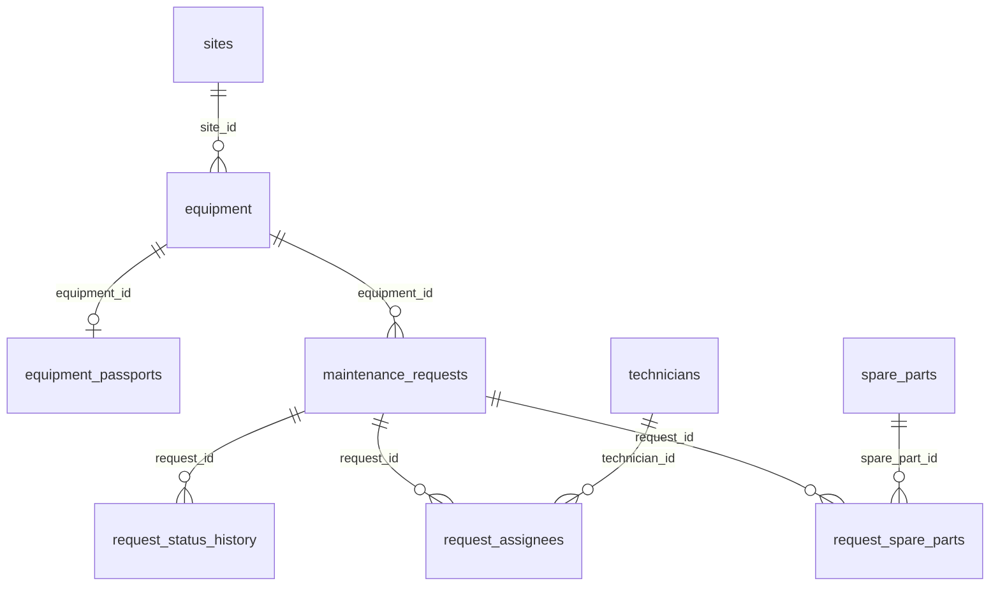
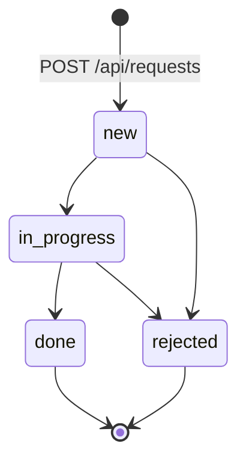

# Equipment Maintenance API

REST API для учёта оборудования ветро- и солнечной генерации и заявок на обслуживание. По координатам оборудования запрашивается прогноз Open-Meteo: можно понять, подходят ли ближайшие сутки для наружных работ (нет осадков и ветер ниже порога).

Учёт оборудования и заявок лежит в PostgreSQL. К базе ходит Sequelize: модели в `src/db/models`, миграции и сиды — через `sequelize-cli`. Изменяющие запросы (`POST`, `PATCH`, `DELETE`) требуют ключ в `X-API-Key` или `Authorization: Bearer <ключ>`. GET открыт.

Базовый URL: `http://localhost:3000/api`.

## Запуск с нуля

Node.js 20+, npm, Docker. Open-Meteo нужен только для `GET /api/equipment/:id/weather`.

```bash
git clone https://github.com/marylaf/weather-digest.git
cd weather-digest
cp .env.example .env
npm install
docker compose up -d --wait postgres
npm run db:migrate
npm run db:seed
npm run api
```

`DB_HOST=localhost` в `.env.example` — это хост, с которого запускаются `npm run api` и `sequelize-cli`. В контейнере `api` хост переопределён на `postgres`. Пароли и `API_KEY` берутся из `.env`, в репозиторий их не кладут.

API подключается как `DB_APP_USER`. Эта роль читает и меняет рабочие таблицы, в `request_status_history` может только вставлять строки. `UPDATE` и `DELETE` журнала ей не выданы, как и право создавать объекты в схеме. Миграции и сиды выполняет владелец `DB_USER`: `npm run db:migrate` сначала создаёт роль приложения (`scripts/ensure-app-role.cjs`), затем накатывает миграции и выдаёт права.

`npm run db:seed` применяет демо-данные и сид импорта. Каталога `data/` в git нет. Если нет ни `./data/equipment.json`, ни `./data/requests.json`, импорт пропускается, и для API с коллекцией Postman хватает демо-сида. Если на месте только один из двух файлов, сид останавливается с ошибкой.

## PostgreSQL

Контейнер `postgres` — образ `postgres:16-alpine`. Имя базы, пользователь и пароль берутся из `DB_NAME`, `DB_USER`, `DB_PASSWORD` (без них compose не стартует). Порт на хосте — `DB_PORT`, по умолчанию `5432`. Данные — volume `postgres_data`. Healthcheck — `pg_isready`.

```bash
docker compose up -d --wait postgres
```

`docker compose up --build api` поднимает и Postgres (у `api` стоит `depends_on` с `condition: service_healthy`), но таблицы сам не создаёт. Миграции по-прежнему с хоста.

### Миграции

Файлы: `src/db/migrations/`. Пути CLI задаёт `.sequelizerc`, подключение — `src/db/sequelize-cli.cjs` (читает `.env`).

```bash
npm run db:migrate
```

Порядок: `sites`, `equipment`, `equipment_passports`, `technicians`, `maintenance_requests`, `request_status_history`, `request_assignees`, затем `deleted_at` и частичный уникальный `serial_number`, права роли приложения, индексы поиска, `spare_parts` и `request_spare_parts`.

### Сиды

```bash
npm run db:seed
npm run db:seed:undo:all
```

`20260928230000-demo-maintenance.cjs` кладёт две площадки (`MSK-NORTH`, `SOCHI-COAST`), шесть единиц оборудования с паспортами, пять техников и заявки с историей и назначениями. Идентификаторы, на которые опирается Postman: `siteId` `a1111111-1111-4111-8111-111111111111`, техники `d0000000-0000-4000-8000-000000000001` и `…0002`.

`20260928230100-import-file-storage.cjs` переносит JSON Кейса 2 в те же таблицы, когда заданы оба файла (`EQUIPMENT_FILE` и `REQUESTS_FILE`, по умолчанию `./data/equipment.json` и `./data/requests.json`). Эти пути читает только сид, не API. Импорт помечает заявки автором `file-import`, площадки — кодом с префиксом `FILE-`. Без обоих файлов сид пишет в stdout, что импорт пропущен, и завершается успешно.

### Откат миграций

```bash
npm run db:migrate:undo
npm run db:migrate:undo:all
npm run db:migrate
```

`db:migrate:undo` снимает последнюю миграцию, `db:migrate:undo:all` — все, в обратном порядке. Повторное `db:migrate` накатывает их снова. Вместе с таблицей пропадают и строки в ней; после полного отката сиды запускают заново.

Если нужно выбросить и данные volume:

```bash
docker compose down -v
docker compose up -d --wait postgres
npm run db:migrate
npm run db:seed
```

`down -v` удаляет `postgres_data`.

## Схема базы

| Таблица                  | Содержание                                                                                                 |
| ------------------------ | ---------------------------------------------------------------------------------------------------------- |
| `sites`                  | Площадка: `name`, уникальный `code`, `region`, `latitude`, `longitude`                                     |
| `equipment`              | Единица: `site_id`, `name`, тип и статус (enum), `serial_number`, `installation_date`, `deleted_at`        |
| `equipment_passports`    | Паспорт: `manufacturer`, `model`, `nominal_power`, `last_verification_date`. Один на оборудование          |
| `technicians`            | Специалист: `full_name`, `specialization`, уникальный `employee_number`                                    |
| `maintenance_requests`   | Заявка: `equipment_id`, `title`, `description`, `priority`, `status`, `planned_at`, `author`, `deleted_at` |
| `request_status_history` | Смена статуса: `old_status`, `new_status`, `changed_by`, `comment`. Строки только добавляются              |
| `request_assignees`      | Назначение: пара `(request_id, technician_id)`, `role` (`lead` \| `member`), `hours`                       |
| `spare_parts`            | Запчасть: `name`, `sku` (уникален при `deleted_at IS NULL`), `stock_quantity`, `deleted_at`                |
| `request_spare_parts`    | Расход: пара `(request_id, spare_part_id)`, `quantity`                                                     |

У `request_status_history` триггер `request_status_history_forbid_mutation`: `UPDATE` и `DELETE` отклоняются. У роли приложения нет прав на эти команды. Скрытие заявки или оборудования ставит `deleted_at` и не трогает журнал.

`serial_number` уникален среди строк с `deleted_at IS NULL` (частичный индекс `equipment_serial_number_active_idx`). После скрытия оборудования тот же серийный номер можно выдать снова.

Связи:

- площадка — оборудование, 1:N (`equipment.site_id` → `sites.id`, `ON DELETE RESTRICT`);
- оборудование — паспорт, не больше одного (`equipment_passports.equipment_id` уникален, `ON DELETE CASCADE`); паспорта может не быть;
- оборудование — заявки, 1:N (`ON DELETE RESTRICT`);
- заявка — история статусов, 1:N (`ON DELETE RESTRICT`);
- заявка — техники, N:M через `request_assignees`. У заявки не больше одного `lead`: частичный уникальный индекс `request_assignees_one_lead_per_request`;
- заявка — запчасти, N:M через `request_spare_parts` (`quantity`). Списание остатка и вставка строки идут в одной транзакции. `sku` уникален при `deleted_at IS NULL`.


```mermaid
erDiagram
  sites ||--o{ equipment : "site_id"
  equipment ||--o| equipment_passports : "equipment_id"
  equipment ||--o{ maintenance_requests : "equipment_id"
  maintenance_requests ||--o{ request_status_history : "request_id"
  maintenance_requests ||--o{ request_assignees : "request_id"
  technicians ||--o{ request_assignees : "technician_id"
  maintenance_requests ||--o{ request_spare_parts : "request_id"
  spare_parts ||--o{ request_spare_parts : "spare_part_id"
```

Площадка не копируется в каждую строку `equipment`: там только `site_id`. Паспорт — отдельная таблица, а не те же поля внутри оборудования. Техник описан в `technicians` один раз, в заявке на него ссылается `request_assignees` (роль и часы). Смены статуса лежат в `request_status_history`, а не колонками на заявке. Повторяющихся групп нет — схема в 3NF.

## Эндпоинты

Список — `{ "data", "meta" }`, карточка — `{ "data" }`, удаление — пустое тело. В карточке оборудования добавилось `passport` (`null`, если паспорта нет). В карточке заявки — `assignedTechnicians` (у новой заявки `[]`). В списке заявок этого поля нет: JOIN с назначениями сломал бы `LIMIT`.

| Метод    | Путь                                  | Auth | Код           | Описание                                                                                                                       |
| -------- | ------------------------------------- | ---- | ------------- | ------------------------------------------------------------------------------------------------------------------------------ |
| `GET`    | `/api/health`                         | нет  | `200`         | Проверка живости: `{ "status": "ok" }`                                                                                         |
| `GET`    | `/api/equipment`                      | нет  | `200`         | Список оборудования. Query: `status`, `type`, `installedFrom`, `installedTo`, `q`, `sortBy`, `order`, `page`, `limit`          |
| `POST`   | `/api/equipment`                      | да   | `201`         | Создать оборудование. Заголовок `Location: /api/equipment/:id`                                                                 |
| `GET`    | `/api/equipment/:id`                  | нет  | `200`         | Карточка оборудования                                                                                                          |
| `PATCH`  | `/api/equipment/:id`                  | да   | `200`         | Частичное обновление                                                                                                           |
| `DELETE` | `/api/equipment/:id`                  | да   | `204`         | Удалить, если нет открытых заявок (`new` / `in_progress`)                                                                      |
| `GET`    | `/api/equipment/:id/requests`         | нет  | `200`         | Заявки по оборудованию. Query: `status`, `priority`, `createdFrom`, `createdTo`, `sortBy`, `order`, `page`, `limit`            |
| `GET`    | `/api/equipment/:id/weather`          | нет  | `200`         | Прогноз Open-Meteo и флаг `outdoorWorkSuitable`                                                                                |
| `GET`    | `/api/requests`                       | нет  | `200`         | Список заявок. Query: `status`, `priority`, `equipmentId`, `createdFrom`, `createdTo`, `q`, `sortBy`, `order`, `page`, `limit` |
| `POST`   | `/api/requests`                       | да   | `201`         | Создать заявку (`status` всегда `new`). `Location: /api/requests/:id`                                                          |
| `POST`   | `/api/requests/import`                | да   | `201` / `207` | Пакетная загрузка: ошибки по записям не откатывают успешные. До 100 элементов                                                  |
| `GET`    | `/api/requests/:id`                   | нет  | `200`         | Карточка заявки, включая `assignedTechnicians` и `spareParts`                                                                  |
| `POST`   | `/api/requests/:id/assignees`         | да   | `200`         | Заменить бригаду целиком. Ровно один `lead`                                                                                    |
| `DELETE` | `/api/requests/:id/assignees/:userId` | да   | `204`         | Снять одного техника. `:userId` — это `technicians.id`                                                                         |
| `GET`    | `/api/requests/:id/history`           | нет  | `200`         | История смен статуса, по `createdAt`                                                                                           |
| `GET`    | `/api/sites/:id/summary`              | нет  | `200`         | Сводка заявок площадки: счётчики по статусу и приоритету, среднее время закрытия                                               |
| `GET`    | `/api/reports/equipment-load`         | нет  | `200`         | Нагрузка оборудования. Query: `createdFrom`, `createdTo`, `minRequests`                                                        |
| `GET`    | `/api/spare-parts`                    | нет  | `200`         | Список запчастей. Query: `q`, `sortBy`, `order`, `page`, `limit`                                                               |
| `POST`   | `/api/spare-parts`                    | да   | `201`         | Создать запчасть. `sku` уникален среди нескрытых                                                                               |
| `GET`    | `/api/spare-parts/:id`                | нет  | `200`         | Карточка запчасти                                                                                                              |
| `DELETE` | `/api/spare-parts/:id`                | да   | `204`         | Скрыть запчасть. Тот же `sku` можно создать снова                                                                              |
| `POST`   | `/api/requests/:id/spare-parts`       | да   | `200`         | Списать запчасть на заявку. Нехватка остатка или повтор пары — `409`                                                           |
| `PATCH`  | `/api/requests/:id`                   | да   | `200`         | Поля заявки без смены статуса                                                                                                  |
| `PATCH`  | `/api/requests/:id/status`            | да   | `200`         | Смена статуса по графу переходов                                                                                               |
| `DELETE` | `/api/requests/:id`                   | да   | `204`         | Удалить заявку                                                                                                                 |

Списки отвечают `{ "data": [...], "meta": { "total", "page", "limit" } }`. По умолчанию `page=1`, `limit=10`, максимум `limit=100`. Карточка — `{ "data": { ... } }`. Удаление — пустое тело.

### `POST /api/requests/:id/assignees`

Заменяет состав бригады целиком. В теле массив `assignees`: `technicianId`, `role` (`lead` или `member`), необязательные `hours` (число или строка, 0…9999.99; если нет — `0.00`). Нужен хотя бы один человек, ровно один `lead`, без повтора `technicianId`. Ответ — карточка заявки.

Техники ниже — из демо-сида.

```bash
curl -s http://localhost:3000/api/requests/e0000000-0000-4000-8000-000000000001/assignees \
  -H "Content-Type: application/json" \
  -H "X-API-Key: $API_KEY" \
  -d '{
    "assignees": [
      { "technicianId": "d0000000-0000-4000-8000-000000000001", "role": "lead", "hours": 4 },
      { "technicianId": "d0000000-0000-4000-8000-000000000002", "role": "member", "hours": "2.00" }
    ]
  }'
```

```json
{
  "data": {
    "id": "e0000000-0000-4000-8000-000000000001",
    "equipmentId": "b0000000-0000-4000-8000-000000000001",
    "title": "Осмотр лопастей северного ряда",
    "status": "new",
    "priority": "low",
    "assignedTechnicians": [
      {
        "id": "d0000000-0000-4000-8000-000000000001",
        "fullName": "Иванов Алексей Сергеевич",
        "specialization": "Электрика",
        "employeeNumber": "EMP-1001",
        "role": "lead",
        "hours": "4.00"
      },
      {
        "id": "d0000000-0000-4000-8000-000000000002",
        "fullName": "Петрова Мария Игоревна",
        "specialization": "Механика ветроустановок",
        "employeeNumber": "EMP-1002",
        "role": "member",
        "hours": "2.00"
      }
    ]
  }
}
```

Нет заявки или техника — `404`. Ноль или два `lead`, пустой список — `422`. Повтор специалиста и конфликт уникальности пары `(request_id, technician_id)` — `409`, транзакция откатывается.

### `DELETE /api/requests/:id/assignees/:userId`

Снимает одно назначение. В пути `userId` — это `technicians.id`. Успех — `204` без тела.

```bash
curl -s -X DELETE \
  http://localhost:3000/api/requests/e0000000-0000-4000-8000-000000000001/assignees/d0000000-0000-4000-8000-000000000002 \
  -H "X-API-Key: $API_KEY"
```

`404`, если нет заявки, техника или такой пары в `request_assignees`. Снять `lead` можно, пустая бригада после этого тоже допустима. Правило «ровно один lead» проверяется при полной замене, не при удалении строки.

### `GET /api/requests/:id/history`

История смен статуса по возрастанию `createdAt`. Заявка, созданная через API, до первого `PATCH .../status` отдаёт пустой массив: запись появляется вместе со сменой статуса. У демо-сида история уже есть, включая создание.

```bash
curl -s http://localhost:3000/api/requests/e0000000-0000-4000-8000-000000000001/history
```

```json
{
  "data": [
    {
      "id": "f0000000-0000-4000-8000-000000000011",
      "requestId": "e0000000-0000-4000-8000-000000000001",
      "oldStatus": null,
      "newStatus": "new",
      "changedBy": "Диспетчерская Москва",
      "comment": "Заявка создана",
      "createdAt": "2026-01-12T08:00:00.000Z"
    }
  ]
}
```

Неизвестная заявка — `404`. Смена через API пишет `changedBy: "api"`.

## Модель

### Equipment

| Поле           | Тип            | Ограничения                                                                                                 |
| -------------- | -------------- | ----------------------------------------------------------------------------------------------------------- |
| `id`           | string         | UUID, выдаёт сервер                                                                                         |
| `name`         | string         | 3–100 символов                                                                                              |
| `type`         | enum           | `turbine` \| `inverter` \| `sensor` \| `substation`                                                         |
| `serialNumber` | string         | не пустой, уникален среди нескрытого оборудования                                                           |
| `location.lat` | number         | −90…90                                                                                                      |
| `location.lon` | number         | −180…180                                                                                                    |
| `status`       | enum           | `operational` \| `maintenance` \| `fault` \| `decommissioned`                                               |
| `installedAt`  | string         | ISO-дата, не в будущем                                                                                      |
| `passport`     | object \| null | `id`, `manufacturer`, `model`, `nominalPower`, `lastVerificationDate`. У созданного через API обычно `null` |

`location` в ответе — координаты площадки. `POST /api/equipment` ищет площадку с кодом `api-{lat}-{lon}` (шесть знаков после точки) и создаёт её, если такой ещё нет. Одинаковые координаты попадают на одну площадку.

### MaintenanceRequest

| Поле                  | Тип     | Ограничения                                                                                                 |
| --------------------- | ------- | ----------------------------------------------------------------------------------------------------------- |
| `id`                  | string  | UUID, выдаёт сервер                                                                                         |
| `equipmentId`         | string  | должен существовать                                                                                         |
| `title`               | string  | 5–120 символов                                                                                              |
| `description`         | string  | до 2000 символов                                                                                            |
| `priority`            | enum    | `low` \| `medium` \| `high` \| `critical`                                                                   |
| `status`              | enum    | `new` \| `in_progress` \| `done` \| `rejected`                                                              |
| `plannedAt`           | string? | ISO datetime                                                                                                |
| `createdAt`           | string  | ISO datetime, выдаёт сервер                                                                                 |
| `updatedAt`           | string  | ISO datetime, выдаёт сервер                                                                                 |
| `assignedTechnicians` | array   | только в карточке, не в списке. Поля: `id`, `fullName`, `specialization`, `employeeNumber`, `role`, `hours` |

## Переходы статусов заявки

Статус меняется только через `PATCH /api/requests/:id/status`. Терминальные `done` и `rejected` дальше не двигаются. Недопустимый переход — `409 CONFLICT`.


```mermaid
stateDiagram-v2
  [*] --> new: POST /api/requests
  new --> in_progress
  new --> rejected
  in_progress --> done
  in_progress --> rejected
  done --> [*]
  rejected --> [*]
```

| Из            | Куда                      |
| ------------- | ------------------------- |
| `new`         | `in_progress`, `rejected` |
| `in_progress` | `done`, `rejected`        |
| `done`        | —                         |
| `rejected`    | —                         |

Открытые заявки — `new` и `in_progress`. Закрытые — `done` и `rejected`.

## Транзакции

Смена статуса и запись в `request_status_history` идут в одной транзакции. Строка заявки берётся с `SELECT ... FOR UPDATE`, затем проверяется граф переходов. Если история не записалась, статус тоже откатывается.

Переход в `in_progress` при пустой бригаде — `409`, `Cannot set status to in_progress without assigned technicians`. Заявка остаётся в прежнем статусе.

Замена бригады тоже под блокировкой строки заявки: старые назначения удаляются, новые вставляются. Если в теле не ровно один `lead`, ответ `422` (`В бригаде должен быть ровно один специалист с ролью lead`) и в базу ничего не пишется. Повтор техника и нарушение уникального индекса — `409`, изменения откатываются.

Снятие одного назначения — отдельная короткая транзакция. Оно не проверяет, остался ли `lead`.

`POST /api/requests/:id/spare-parts` блокирует заявку и строку запчасти, уменьшает `stock_quantity` и вставляет `request_spare_parts`. Если остатка меньше `quantity` или пара уже есть, ответ `409` и остаток не меняется. Проверка `stock_quantity >= 0` стоит и в схеме.

## Удаление оборудования

`DELETE /api/equipment/:id` при заявках `new` или `in_progress` возвращает `409` (`Equipment has open maintenance requests`). Внешний ключ `maintenance_requests.equipment_id` сам по себе `ON DELETE RESTRICT`, поэтому открытую заявку база тоже не даст обойти.

Закрытые заявки (`done`, `rejected`) удалению не мешают: в той же транзакции им и оборудованию проставляется `deleted_at`. Строки истории и назначений остаются. Паспорт и площадка остаются. Списки и отчёты такие строки не показывают. `GET` по прежнему id отвечает `404`.

## Отчёты

### `GET /api/sites/:id/summary`

Считает заявки оборудования этой площадки. Ключ не нужен. Неизвестная площадка — `404` (`Site not found`). Площадка без заявок отдаёт нули и `averageCloseTimeSeconds: null`.

```bash
curl -s http://localhost:3000/api/sites/a1111111-1111-4111-8111-111111111111/summary
```

`a1111111-1111-4111-8111-111111111111` — площадка `MSK-NORTH` из демо-сида. После этого сида ответ такой:

```json
{
  "data": {
    "siteId": "a1111111-1111-4111-8111-111111111111",
    "requestsByStatus": { "new": 4, "in_progress": 3, "done": 4, "rejected": 2 },
    "requestsByPriority": { "low": 3, "medium": 3, "high": 3, "critical": 4 },
    "averageCloseTimeSeconds": 158400
  }
}
```

`averageCloseTimeSeconds` — среднее число секунд от `created_at` до первой записи в `request_status_history`, где статус стал `done` или `rejected`. Открытые заявки и закрытые без такой записи в среднее не входят. Счётчики и среднее считаются в PostgreSQL.

### `GET /api/reports/equipment-load`

По каждой единице оборудования: число заявок, число закрытых (`done` и `rejected`), сумма плановых часов бригады (`request_assignees.hours`) и дата последнего выполнения (`MAX` времени перехода в `done`). Часы и история агрегируются до JOIN, чтобы несколько назначений и несколько строк истории не умножали сумму.

Период режет заявки по `created_at`. Имена как у списка заявок: `createdFrom` и `createdTo`. Те же границы принимают `dateFrom` / `from` и `dateTo` / `to`, но вместе с каноническим именем значение должно совпадать. Дата `YYYY-MM-DD` для начала — `00:00:00.000Z`, для конца — `23:59:59.999Z`. Полный ISO datetime берётся как есть.

`minRequests` — целое `>= 0`. Оно попадает в `HAVING` и отбрасывает оборудование с меньшим числом заявок в периоде. Если параметр не передан, порог `0`: единицы без заявок остаются, с нулями и `lastMaintenanceAt: null`.

Нечисло, отрицательный `minRequests`, неразборчивая дата или `createdFrom` позже `createdTo` — `400`. Ключ не нужен.

```bash
curl -s "http://localhost:3000/api/reports/equipment-load?createdFrom=2026-01-01&createdTo=2026-12-31&minRequests=1"
```

```json
{
  "data": [
    {
      "equipmentId": "8f3c1a2b-4d5e-6f70-8192-a3b4c5d6e7f8",
      "name": "Moscow turbine",
      "requestCount": 3,
      "closedRequestCount": 2,
      "plannedLaborHours": "6.50",
      "lastMaintenanceAt": "2026-01-01T02:00:00.000Z"
    }
  ]
}
```

## Запросы к PostgreSQL

Значения в сыром SQL передаются через `bind` (отчёты) или `replacements` (сиды). В строку запроса они не склеиваются.

`sortBy` принимается только из белого списка и мапится на заранее записанное выражение. Для оборудования: `name`, `type`, `status`, `serialNumber`, `installedAt`. Для заявок: `title`, `priority`, `status`, `createdAt`, `plannedAt`, `equipmentId`. `order` — `asc` или `desc`. Чужое поле — `422`.

`q` ищет подстроку без учёта регистра: у оборудования по `name` и `serialNumber`, у заявок по `title` и `description`. Символы `%`, `_` и `\` в тексте запроса остаются обычными символами. Запрос — `ILIKE` с привязкой параметра, индекс `GIN` с `pg_trgm`.

`page` и `limit` проверяются до запроса. `limit` — целое от 1 до 100, `page` — целое от 1, смещение не больше 100000. Иначе `400`.

Индексы под списки и поиск: `equipment_status_type_active_idx`, `equipment_name_trgm_idx`, `maintenance_requests_status_created_at_idx`, `maintenance_requests_title_trgm_idx`. Сравнение плана до и после — в `docs/explain-indexes.md`.

## Формат ошибки

Все ошибки API — один JSON. Поле `details` есть у валидации.

```json
{
  "error": {
    "code": "VALIDATION_ERROR",
    "message": "Некорректные данные запроса",
    "details": [{ "field": "name", "message": "Слишком короткое значение" }],
    "requestId": "7c2e9a1b-4f0d-4c8a-9e21-0b1c2d3e4f5a"
  }
}
```

| HTTP | `code`                         | Когда                                                                                               |
| ---- | ------------------------------ | --------------------------------------------------------------------------------------------------- |
| 400  | `VALIDATION_ERROR`             | битый JSON, неверные `page`/`limit` или query `/api/reports/equipment-load`                         |
| 422  | `VALIDATION_ERROR`             | Zod: невалидные body, query или params                                                              |
| 401  | `UNAUTHORIZED`                 | нет или неверный ключ на POST/PATCH/DELETE                                                          |
| 404  | `NOT_FOUND`                    | неизвестный id, маршрут или `equipmentId` при создании заявки                                       |
| 409  | `CONFLICT`                     | занятый `serialNumber`, открытые заявки при удалении, запрещённый статус, `in_progress` без бригады |
| 413  | `PAYLOAD_TOO_LARGE`            | JSON больше `JSON_BODY_LIMIT` (по умолчанию 100kb)                                                  |
| 429  | `RATE_LIMIT_EXCEEDED`          | превышен лимит `/api`                                                                               |
| 503  | `EXTERNAL_SERVICE_UNAVAILABLE` | Open-Meteo недоступен или вернул некорректный ответ                                                 |
| 500  | `INTERNAL_ERROR`               | непредвиденная ошибка                                                                               |

## Примеры 201 / 400 / 409

### 201 Created

```bash
curl -s -D - http://localhost:3000/api/equipment \
  -H "Content-Type: application/json" \
  -H "X-API-Key: $API_KEY" \
  -d '{
    "name": "Moscow turbine",
    "type": "turbine",
    "serialNumber": "WT-001",
    "location": { "lat": 55.75, "lon": 37.62 },
    "status": "operational",
    "installedAt": "2024-06-01"
  }'
```

```http
HTTP/1.1 201 Created
Location: /api/equipment/8f3c1a2b-4d5e-6f70-8192-a3b4c5d6e7f8
```

```json
{
  "data": {
    "id": "8f3c1a2b-4d5e-6f70-8192-a3b4c5d6e7f8",
    "name": "Moscow turbine",
    "type": "turbine",
    "serialNumber": "WT-001",
    "location": { "lat": 55.75, "lon": 37.62 },
    "status": "operational",
    "installedAt": "2024-06-01",
    "passport": null
  }
}
```

Так же создаётся заявка: `POST /api/requests` с `equipmentId`, `title` (≥ 5 символов), `description`, `priority`. Сервер ставит `status: "new"` и `assignedTechnicians: []`.

### 422 VALIDATION_ERROR

`name` короче 3 символов (схема Zod). Битый JSON (`{"name":`) даёт тот же `code`, но HTTP **400**.

```bash
curl -s http://localhost:3000/api/equipment \
  -H "Content-Type: application/json" \
  -H "X-API-Key: $API_KEY" \
  -d '{
    "name": "ab",
    "type": "turbine",
    "serialNumber": "WT-002",
    "location": { "lat": 55.75, "lon": 37.62 },
    "status": "operational",
    "installedAt": "2024-06-01"
  }'
```

```json
{
  "error": {
    "code": "VALIDATION_ERROR",
    "message": "Некорректные данные запроса",
    "details": [{ "field": "name", "message": "Слишком короткое значение" }],
    "requestId": "…"
  }
}
```

### 409 CONFLICT

Повтор того же `serialNumber`:

```bash
curl -s http://localhost:3000/api/equipment \
  -H "Content-Type: application/json" \
  -H "X-API-Key: $API_KEY" \
  -d '{ … "serialNumber": "WT-001" … }'
```

```json
{
  "error": {
    "code": "CONFLICT",
    "message": "Equipment with this serialNumber already exists",
    "requestId": "…"
  }
}
```

Другие `409`:

- `PATCH /api/requests/:id/status` с `{ "status": "done" }` у заявки в `new` → `Cannot transition status from new to done`
- `DELETE /api/equipment/:id`, пока есть заявки `new` / `in_progress` → `Equipment has open maintenance requests`
- `PATCH /api/requests/:id/status` с `{ "status": "in_progress" }` без назначений → `Cannot set status to in_progress without assigned technicians`

### 400 VALIDATION_ERROR

```bash
curl -s http://localhost:3000/api/equipment \
  -H "Content-Type: application/json" \
  -H "X-API-Key: $API_KEY" \
  -d '{"name":'
```

Ответ: `400`, `code: "VALIDATION_ERROR"`, `details[0].field: "body"`.

## CORS

Allowlist, не `*`. По умолчанию:

| Origin                  | Зачем                                                              |
| ----------------------- | ------------------------------------------------------------------ |
| `http://localhost:3000` | Express отдаёт API и статическую HTML-страницу заявок (`public/`)  |
| `http://localhost:5173` | Vite (`npm run web`, порт из `web/vite.config.ts`) — другой origin |

Браузер с `:5173` ходит на API на `:3000` — это cross-origin, без явного origin запрос режется. Страница на `:3000` того же origin, что и API, но origin всё равно в списке: так одинаково работают fetch с UI, превью и инструменты с заголовком `Origin`.

Запросы без `Origin` (curl, Postman, серверные тесты) пропускаются. Переопределение: `CORS_ORIGINS` через запятую, без `*`. Разрешённые методы: `GET`, `HEAD`, `POST`, `PATCH`, `DELETE`, `OPTIONS`. Заголовки: `Content-Type`, `X-Request-Id`, `X-API-Key`, `Authorization`. Наружу отдаётся `X-Request-Id`.

## Rate limit

Лимит висит на всём `/api` (`express-rate-limit`).

| Параметр               | По умолчанию | Смысл                        |
| ---------------------- | ------------ | ---------------------------- |
| `RATE_LIMIT_WINDOW_MS` | `60000`      | окно, 1 минута               |
| `RATE_LIMIT_MAX`       | `100`        | запросов с одного IP за окно |

При превышении — `429` с `code: "RATE_LIMIT_EXCEEDED"` и `message: "Too many requests"`. В ответе стандартные заголовки `RateLimit-*`.

Тело JSON ограничено `JSON_BODY_LIMIT` (по умолчанию `100kb`) — сверх лимита `413 PAYLOAD_TOO_LARGE`. Защитные заголовки ставит `helmet`.

Cookie не используются: аутентификация идёт заголовком `X-API-Key` / `Authorization`, сессии нет. Поэтому флаги `HttpOnly`, `Secure` и `SameSite` не выставляются — выставлять SameSite без cookie бессмысленно.

## Правило погоды

`GET /api/equipment/:id/weather` берёт координаты оборудования, запрашивает прогноз Open-Meteo на 3 дня и считает, можно ли выходить на площадку.

Наружные работы допустимы (`outdoorWorkSuitable: true`), только если **в первый день** прогноза:

1. осадки равны нулю: `precipitation === 0`;
2. максимальная скорость ветра строго ниже порога: `windSpeed < MAX_WIND_SPEED`.

`MAX_WIND_SPEED` по умолчанию `10` (м/с в `UNITS=metric`, mph в `imperial`). Пустой прогноз → `false`. Сбой Open-Meteo → `503 EXTERNAL_SERVICE_UNAVAILABLE`.

```json
{
  "data": {
    "equipmentId": "8f3c1a2b-4d5e-6f70-8192-a3b4c5d6e7f8",
    "outdoorWorkSuitable": true,
    "weather": {
      "coordinates": { "latitude": 55.75, "longitude": 37.62 },
      "units": "metric",
      "forecast": [
        {
          "date": "2026-09-20",
          "minTemperature": 7.7,
          "maxTemperature": 16.2,
          "precipitation": 0,
          "windSpeed": 4.2
        }
      ]
    }
  }
}
```

## Слои

Маршрут проверяет Zod и отдаёт управление контроллеру. Контроллер читает `req`/`res` и вызывает сервис. Сервис держит правила: статусы, бригада, уникальный `serialNumber`. Репозиторий ходит в PostgreSQL через модели Sequelize (`src/db/models`). Схему создают миграции, `sync` в приложении нет.

```text
src/api/
├── server.ts                 # listen, проверка API_KEY
├── app.ts                    # сборка middleware и роутеров
├── httpClient.ts             # исходящий HTTP к Open-Meteo
├── weatherApi.ts             # парсинг прогноза
├── geocodingApi.ts           # геокодинг для CLI
├── routes/                   # пути и validate()
│   ├── equipment.routes.ts
│   ├── request.routes.ts
│   ├── site.routes.ts
│   ├── report.routes.ts
│   └── health.routes.ts
├── controllers/              # req/res → сервис, статус и Location
│   ├── equipment.controller.ts
│   ├── request.controller.ts
│   ├── report.controller.ts
│   └── health.controller.ts
├── services/                 # правила: уникальность, статусы, погода
│   ├── equipment.service.ts
│   ├── request.service.ts
│   └── report.service.ts
├── repositories/             # PostgreSQL через Sequelize
│   ├── equipment.repository.ts
│   ├── request.repository.ts
│   ├── report.repository.ts
│   ├── listQuery.ts
│   └── db.ts
├── validators/               # схемы Zod
│   ├── equipment.ts
│   ├── request.ts
│   ├── report.ts
│   └── common.ts
└── middlewares/
    ├── requestId.ts          # X-Request-Id
    ├── requestLogger.ts      # pino-http
    ├── cors.ts
    ├── rateLimit.ts          # только /api
    ├── requireApiKey.ts      # POST/PATCH/DELETE
    ├── validate.ts           # body / query / params
    ├── asyncHandler.ts
    ├── notFound.ts
    └── errorHandler.ts       # единый { error: { code, message, requestId } }
```

Ошибки сервиса (`ValidationError`, `NotFoundError`, `ConflictError`, …) ловит `errorHandler`.

Порядок middleware в `app.ts` (и почему так):

1. `requestId` — сразу выдаёт `X-Request-Id`, чтобы он был в логах и в ошибках, даже если дальше упадёт разбор JSON.
2. `requestLogger` (pino-http) — метод, путь, статус, duration, `requestId`.
3. `helmet` и CORS — заголовки и origin до чтения тела.
4. `express.json({ limit })` — размер тела и парсинг JSON.
5. rate limit и API-ключ только на `/api`.
6. роуты с `validate()` (body / params / query).
7. `notFound` → `errorHandler`.

Request id стоит раньше лога специально: иначе первая запись была бы без идентификатора, по которому её потом ищут.

## Каталоги

```text
src/
├── api/            # routes, controllers, services, repositories, validators, middlewares
├── config/
├── db/
│   ├── migrations/
│   ├── models/
│   ├── seeders/
│   └── queries/
├── errors/
├── format/         # CLI
├── services/       # CLI-сводка погоды, не HTTP
├── storage/
├── types/
└── utils/
tests/
web/                # Vite-просмотр сохранённых отчётов
public/             # HTML заявок, её отдаёт Express
docs/postman/
```

Конфиг CLI для Sequelize — `.sequelizerc` и `src/db/sequelize-cli.cjs`.

## Docker

Образ API собирается из `Dockerfile` (`node:20-alpine`, `npm run build`, потом `node dist/api/server.js`). Миграции в образ не зашиты: их запускают с хоста, пока Postgres уже слушает порт.

```bash
docker compose up --build api
```

Миграции к этому моменту уже применены с хоста, как в разделе «Запуск с нуля»: контейнер таблиц не создаёт. API слушает `http://localhost:3000` (`GET /api/health`, HTML на `/`). В контейнер смонтирован `./public`, `DB_HOST` внутри него — `postgres`. Том базы — `postgres_data`. CLI-сводка по городам: `docker compose run --rm weather-digest`.

## Переменные окружения

| Переменная             | Описание                                                                                                  | По умолчанию                                  |
| ---------------------- | --------------------------------------------------------------------------------------------------------- | --------------------------------------------- |
| `PORT`                 | порт API                                                                                                  | `3000`                                        |
| `NODE_ENV`             | `development` или `production` (в production нет стека)                                                   | `development`                                 |
| `API_KEY`              | секрет для POST/PATCH/DELETE. Обязателен для `npm run api`                                                | —                                             |
| `CORS_ORIGINS`         | origin через запятую, без `*`                                                                             | `http://localhost:5173,http://localhost:3000` |
| `RATE_LIMIT_WINDOW_MS` | окно лимита, мс                                                                                           | `60000`                                       |
| `RATE_LIMIT_MAX`       | запросов на IP за окно                                                                                    | `100`                                         |
| `JSON_BODY_LIMIT`      | максимум JSON body                                                                                        | `100kb`                                       |
| `EQUIPMENT_FILE`       | JSON Кейса 2 для сида импорта. Вместе с `REQUESTS_FILE`; если нет обоих файлов, импорт пропускается       | `./data/equipment.json`                       |
| `REQUESTS_FILE`        | JSON заявок Кейса 2 для того же сида                                                                      | `./data/requests.json`                        |
| `FORECAST_URL`         | прогноз Open-Meteo                                                                                        | `https://api.open-meteo.com/v1/forecast`      |
| `TIMEOUT_MS`           | таймаут исходящих запросов                                                                                | `5000`                                        |
| `REQUEST_TIMEOUT_MS`   | то же, имеет приоритет над `TIMEOUT_MS`                                                                   | —                                             |
| `MAX_WIND_SPEED`       | порог ветра для наружных работ                                                                            | `10`                                          |
| `UNITS`                | `metric` (°C, мм, м/с) или `imperial` (°F, in, mph)                                                       | `metric`                                      |
| `LOG_LEVEL`            | уровень pino: `debug` / `info` / `warn` / `error`                                                         | `debug` в development, `info` в production    |
| `DB_HOST`              | хост PostgreSQL. Для процесса на хосте — `localhost`; compose для контейнера `api` подставляет `postgres` | —                                             |
| `DB_PORT`              | порт PostgreSQL                                                                                           | `5432` у compose, если переменная не задана   |
| `DB_NAME`              | имя базы, обязательно                                                                                     | —                                             |
| `DB_USER`              | владелец схемы для миграций и сидов, обязательно                                                          | —                                             |
| `DB_PASSWORD`          | пароль владельца, обязательно                                                                             | —                                             |
| `DB_APP_USER`          | роль API: DML по рабочим таблицам, по журналу статусов только `SELECT` и `INSERT`                         | —                                             |
| `DB_APP_PASSWORD`      | пароль роли API, обязательно                                                                              | —                                             |
| `DB_POOL_MAX`          | максимум соединений Sequelize                                                                             | `5`                                           |
| `DB_POOL_MIN`          | минимум, не больше `DB_POOL_MAX`                                                                          | `0`                                           |
| `DB_POOL_ACQUIRE_MS`   | ожидание соединения из пула, мс                                                                           | `30000`                                       |
| `DB_POOL_IDLE_MS`      | простой соединения до закрытия, мс                                                                        | `10000`                                       |

CLI-сводка по городам (`npm start -- --city "Москва"`) использует те же `CITY`, `DAYS`, `NO_CACHE`, `GEOCODING_URL`, `REPORTS_DIR`.

## Postman

Коллекция: `docs/postman/Equipment Maintenance API.postman_collection.json`. Импорт в Postman, затем Collection Runner. `{{baseUrl}}` по умолчанию `http://localhost:3000`, `{{apiKey}}` должен совпадать с `API_KEY`. `{{leadTechnicianId}}`, `{{memberTechnicianId}}` и `{{siteId}}` уже стоят на id демо-сида — без `20260928230000-demo-maintenance.cjs` группы Assignees и Reports не найдут техника и площадку.

Порядок папок: Health, Equipment, Requests, Assignees, Request History, Remove Assignee, Status, Negative, Reports, Cleanup, в конце Security. Запрос Rate Limit запускать последним: pre-request делает `rateLimitBurst` вызовов `/api/health`, затем ожидается `429`.

Рядом лежит `docs/postman/Weather Digest API.postman_collection.json` — это вызовы Open-Meteo для CLI, не маршруты Express.

## Команды

| Команда                                | Назначение                                         |
| -------------------------------------- | -------------------------------------------------- |
| `npm run api`                          | Express API и HTML заявок на `:3000`               |
| `npm run api:dev`                      | то же с перезапуском                               |
| `npm test`                             | Jest + Supertest                                   |
| `npm run typecheck`                    | `tsc --noEmit`                                     |
| `npm run lint`                         | ESLint и Prettier                                  |
| `npm run web`                          | Vite, сохранённые отчёты на `:5173`                |
| `npm start -- --city "Москва"`         | CLI-сводка погоды                                  |
| `npm run db:migrate`                   | применить миграции                                 |
| `npm run db:migrate:undo`              | откатить последнюю                                 |
| `npm run db:migrate:undo:all`          | откатить все                                       |
| `npm run db:seed`                      | демо-данные и импорт JSON, если оба файла на месте |
| `npm run db:seed:undo:all`             | откатить сиды                                      |
| `docker compose up -d --wait postgres` | поднять Postgres и дождаться healthcheck           |
| `docker compose up --build api`        | API в контейнере, Postgres поднимется вместе с ним |
| `docker compose down -v`               | остановить и удалить volume базы                   |
